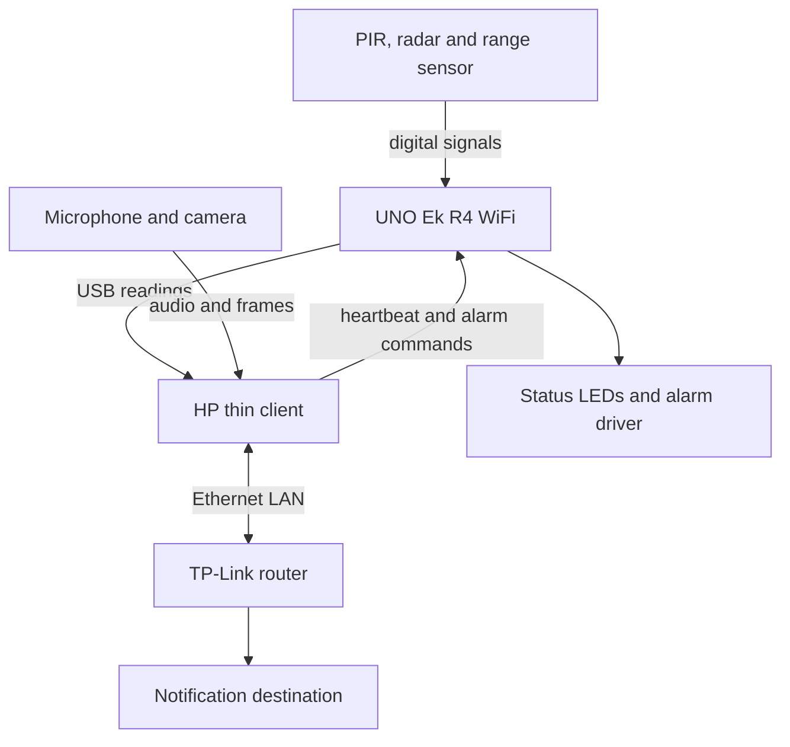

# Electronics plan for the UNO Ek R4 WiFi

Design review: 17 September 2026, with controller-resilience audit updated 19 September 2026. This is a next-stage design and host-executed firmware audit, not a record of a complete electrical circuit simulation or physical test.

## Board and development order

The owner confirmed an Arduino UNO Ek R4 WiFi, made in India. Arduino describes the Ek editions as having the same features and performance as their global counterparts. Use the existing UNO R4 WiFi build target, `arduino:renesas_uno:unor4wifi`. The repository currently pins Renesas UNO core 1.6.0.

The order of work is:

1. Software simulation: exercise audio, image processing, fusion and incident handling. Existing results and failures are in [validation](validation.md).
2. Circuit and firmware verification: settle interfaces, draw the circuit, check electrical behaviour and exercise firmware with controlled inputs. The first datasheet-based lumped electrical simulation now covers D2/D3 level conditioning, HC-SR04 I/O and the D9 MOSFET alarm stage; see [electrical hardware simulation](electrical_hardware_simulation.md). A transistor-level vendor-SPICE simulation of the complete R4/sensor system and physical bench validation have still not run. Rev-B adds the microphone analog front end and Rev-C adds system-level power/ground-return transient simulation.
3. Physical assembly: test individual modules, then integrate the board, HP, router, microphone and camera, and finally evaluate the room.

Stage 1 can be demonstrated as a software project. Its results do not complete stages 2 or 3.

## System connections

The first implementation keeps the USB sensor link already used by the sketch. It avoids adding a second communication transport before acquisition and timestamps work.

This diagram is the intended installation. The current automated notification tests use a local receiver. The microphone and camera interfaces, and the real notification destination, still need selection.

| Item | Job | Decision or missing detail |
|---|---|---|
| UNO Ek R4 WiFi | Read sensors, filter readings, drive indicators and local fallback alarm | Confirmed board; firmware runs on the RA4M1 |
| HP thin client, 8 GB RAM | Audio/video processing, timestamp correlation, recording and delivery | Existing setup notes say t640; owner has also used t460. Check the label before choosing machine-specific drivers |
| TP-Link router | Connect the HP and notification/network clients | Exact model and hardware revision unknown; do not assume repeater mode |
| PIR module | Motion indication | Exact part, supply, output level and hold/retrigger behaviour unknown |
| Radar module | Presence indication | Sketch expects a digital OUT signal; LD2410-class is an assumption, not a confirmed owned part |
| Ultrasonic module | Distance along its beam | Sketch expects an HC-SR04-like trigger/echo interface; actual module unknown |
| Microphone and camera | Sound and image acquisition on the HP | Exact models unknown; infrared night vision and thermal imaging are different interfaces and must not be treated as interchangeable |

The router provides connectivity. It does not automatically increase the Arduino radio's transmit power. Access-point or extender operation depends on the TP-Link model. Arduino wireless telemetry is possible future work; the present sketch does not implement it.

## Pin and electrical contract

This allocation matches [night_security.ino](../firmware/night_security/night_security.ino). Sensor connector pin numbers remain provisional until the actual module datasheets are available.

| R4 connection | Direction | Intended connection |
|---|---|---|
| D2 | Input | PIR OUT, with any required level translation |
| D3 | Input | Radar OUT, with any required level translation |
| D4 | Output | Ultrasonic TRIG |
| D5 | Input | Ultrasonic ECHO |
| D6 / D7 / D8 | Output | Green / yellow / red LEDs, each through its own resistor |
| D9 | Output | Alarm driver control |
| D10 | Input with pull-up | Momentary alarm-clear button to GND |
| USB-C | Bidirectional | HP serial link at 115200 baud |
| GND | Reference | Common reference for the connected low-voltage circuitry |

The R4 main headers use 5 V logic. Arduino specifies an 8 mA GPIO current limit; the ESP32-S3 and Qwiic connector use 3.3 V. These are separate voltage domains.

For the three indicator LEDs, start the design with one 1 kΩ resistor per LED. With an assumed 2 V forward drop, the nominal current is (5 − 2) / 1000 = 3 mA. This is a calculation, not a measurement; check the chosen LEDs and brightness later.

D9 must control a driver, not supply an unspecified buzzer directly. Select the transistor, bias components and supply after the alarm load voltage/current are known. Add suitable flyback protection if the selected load is inductive. The current steady HIGH/LOW output expects an active alarm load; a passive piezo would require a waveform.

A sensor's supply voltage does not establish its output voltage. Check output-high/low specifications against the selected RA4M1 input requirements before deciding whether a buffer is needed.

USB power is sufficient only for a later initial board test within the supply budget. Surviving loss of PC power requires an independent supported board supply and a calculated budget for the sensors and alarm. Those loads are not yet known, so no final power supply or purchase list is specified.

## Online simulator check

Checked against vendor documentation on 17 September 2026:

| Tool | What the documentation establishes | Consequence for this project |
|---|---|---|
| Wokwi | Lists AVR, ESP32, selected STM32 and RP2040 MCUs; no RA4M1. Its Uno model is ATmega328P | Cannot call an Uno/R3 wiring exercise an Ek R4 simulation |
| Renesas MCU Simulator Online | Published supported-product table lists RL78 devices and RA6T2; no RA4M1 | Does not establish a usable online target for this board |
| Proteus Arduino offering | Advertises Arduino AVR simulation | An executable RA4M1 model has not been verified; do not select or buy it on the basis of an Arduino symbol/library |
| GitHub Actions with Arduino CLI | Existing workflow compiles the real R4 target | Checks the build, not execution of the chip or electrical circuit |
| Existing native C++ board driver | Exercises the shared controller logic on a host | Checks filtering and state transitions, not R4 GPIO, USB, watchdog hardware or sensor physics |

An exact online simulation of the complete installation is therefore **not established**. No board substitution has been made. A separately labelled proxy circuit could demonstrate limited input/output logic, but it would leave R4-specific behaviour untested.

## Work required before the wiring stage can be called complete

First close the component choices in the table above. Then draw the schematic with the actual connector pinouts, supply rails, resistor values, driver circuit and any required level translators. A block diagram alone is insufficient.

Keep the actual R4 compile job and shared-core tests. Any additional circuit simulator must state the device models it executes and which parts are merely input stimuli. Save the circuit source and stimulus traces, not only screenshots.

The following checks define the planned circuit/firmware experiment; they are not new passes:

| Stimulus | Required observation |
|---|---|
| Boot and sensor settling | Alarm output inhibited during the first 60 seconds |
| Short PIR/radar pulses | Fewer than three consecutive active samples do not establish persistence |
| Invalid or absent ultrasonic echo | Invalid range, no fictitious zero-distance detection; timeout bounded |
| Valid range changes | Five-sample median and three near results behave as the shared core specifies |
| Host investigation and alarm commands | Correct LED states; GREEN does not clear a latched alarm |
| Lost host health | Transport-only `HB` must not suppress fallback. Degraded state follows when `HEALTH` is absent for more than two seconds; fallback then requires all three filtered sensor conditions for ten consecutive ticks |
| Local reset and subsequent stimulus | Alarm clears, but persistent conditions can cause it to latch again |
| Delayed samples and reconnect | No stale persistence or old-session evidence is reused |

The ten fallback ticks are approximately one second at the intended cadence, after input filtering and the heartbeat condition are satisfied. They are not a one-second guarantee from initial movement.

USB reconnect behaviour, watchdog recovery, actual supply margins and physical sensing coverage still require target-board measurements in stage 3 unless a suitable model is independently validated.

## Integration gaps already visible in the code

- Rev-E now parses the exact USB packet emitted by the UNO, unwraps the 32-bit sequence and `millis()` counters, detects sequence gaps and board restarts, tracks the cumulative board serial-drop counter, and maps board time onto the host acquisition clock. The deterministic fault simulation is in [Rev-E board-to-host serial ingress](board_serial_ingress_reve.md).
- The USB bench tool is still not the complete live acquisition service. A physical serial-port reader still has to feed the Rev-E adapter on the HP, and the resulting board samples must run beside continuous microphone/camera buffers. Physical port-open/reset/reconnect behaviour remains a bench measurement, not a simulated pass.
- Continuous audio, camera and sensor acquisition needs timestamped buffers so a sound trigger can inspect evidence from the same time. Starting the camera only after the sound would lose earlier evidence.
- A binary radar OUT cannot report measurement age or distinguish every failed wire from absence. Firmware cannot recover information that the interface does not provide.
- The local fallback requires PIR, radar and near ultrasonic range together. A person outside the ultrasonic beam can be missed. Placement and the fallback rule must be evaluated before claiming room coverage.

These are specific unfinished pieces. The [hardware resilience audit](hardware_resilience_audit.md) adds host-executed fault tests and fixes several controller bugs, but adding more synthetic scenarios alone will not finish the electrical or physical validation.

## Sources

- [Arduino's UNO Ek R4 announcement](https://blog.arduino.cc/2025/01/25/the-future-of-making-made-in-india/)
- [UNO R4 WiFi datasheet, including voltage and GPIO current limits](https://docs.arduino.cc/resources/datasheets/ABX00087-datasheet.pdf)
- [Wokwi supported hardware](https://docs.wokwi.com/getting-started/supported-hardware) and [its AVR Uno model](https://docs.wokwi.com/parts/wokwi-arduino-uno)
- [Renesas Web Simulator supported products](https://resource.renesas.com/resource/lib/eng/websimulator/index.html)
- [Proteus Arduino simulation](https://www.labcenter.com/arduino_sim/)
- [TP-Link router and access-point modes](https://www.tp-link.com/us/support/faq/2420/)
